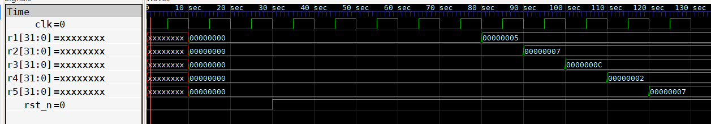
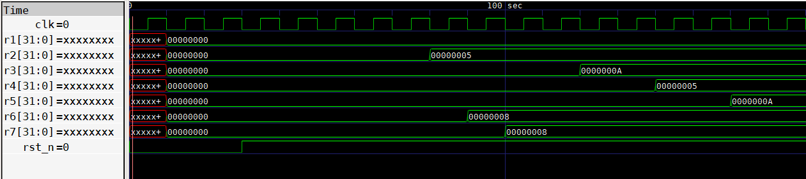
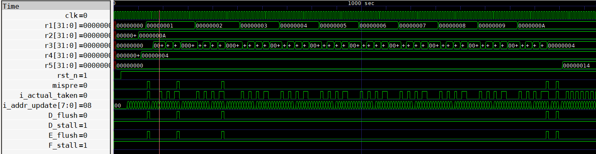
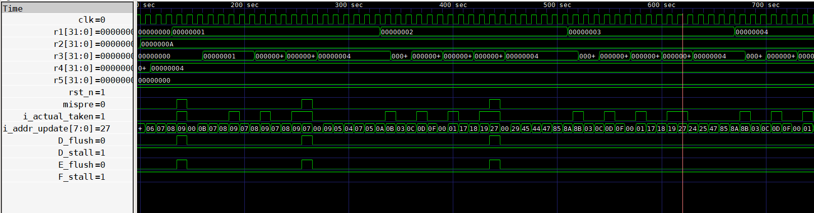

## Simulation & Testing  
To verify the behavior and robustness of the Gshare branch predictor, three distinct test programs were used, each designed to stress different aspects of branch prediction, data independence, and control flow.  
These test cases were written in RV32I assembly and converted to machine code for simulation. The primary goal was to monitor prediction accuracy, detect mispredictions, and evaluate the effectiveness of the snapshot and rollback mechanism under various scenarios.  
## How to Run the Simulation
The simulation setup uses Icarus Verilog to compile and execute the hardware design, and GTKWave to inspect the resulting waveform. A dedicated testbench is used to drive the CPU with different test cases provided in machine code format.  
1. Prepare the test case
   Each test program is written in RV32I assembly and compiled into a .hex or .txt file, which is loaded into instruction memory by the testbench.  
2. Compile the design and testbench
   ```
   iverilog -o RV32I_top_tb RV32I_top_tb.v
   ```
3. Run the simulation
   ```
   vvp RV32I_top_tb
   ```
4. View the waveform
   ```
   gtkwave RV32I_top_tb.vcd
   ```
This setup allows for full-cycle debugging and insight into the internal behavior of the Gshare predictor, including how it responds to control flow, how speculation is handled, and how rollback is triggered on mispredictions.  

### Test 1 – Independent Arithmetic Instructions
This test includes a sequence of independent arithmetic instructions that do not involve branching. It serves as a control case, allowing us to verify that the predictor does not interfere when branches are not present, and that speculative execution proceeds as expected.  
```
addi x1, x0, 5
addi x2, x0, 7
add  x3, x1, x2     # x3 = 5 + 7 = 12
sub  x4, x2, x1     # x4 = 7 - 5 = 2
or   x5, x1, x2     # x5 = 5 | 7 = 7
```
**Purpose**: ensures that the pipeline operates correctly in the absence of branches and that the predictor remains idle without introducing noise or false speculation.  
**Waveform Observation** 



### Test 2 – Memory Access with Control Flow
This test mixes arithmetic and memory access with a small data forwarding scenario. The memory operations help verify that speculative instructions following stores and loads are not incorrectly flushed. It also allows indirect observation of pipeline correctness around control signals.
```
addi x2, x0, 5        # x2 = 5
addi x6, x0, 8        # x6 = 8
add  x7, x3, x6       # x7 = x3 + x6
addi x1, x0, 0        # x1 = 0
addi x3, x0, 10       # x3 = 10 (address)
sw   x2, 0(x3)        # MEM[10] = 5
lw   x4, 0(x3)        # x4 = 5
add  x5, x4, x2       # x5 = 5 + 5 = 10
```
**Purpose**: validates that instructions not dependent on branches are still correctly executed even with memory interaction. It checks for proper behavior of pipeline flush logic when no branches are involved.  
**Waveform Observation** 


### Test 3 – Nested Loops with Branches (Gshare-focused)
This test is specifically designed to evaluate the Gshare branch predictor’s performance. It consists of a nested loop using beq and jal, challenging the predictor with multiple control-flow patterns, especially backward branches which form tight loops.  
```
addi x0, x0, 0          # nop
addi x1, x0, 0          # x1 = 0 (outer loop counter)
addi x2, x0, 10         # x2 = 10 (outer loop limit)
addi x4, x0, 4          # x4 = 4 (inner loop limit)

CONTINUE:
beq x1, x2, SKIP1       # branch: outer loop exit condition
addi x1, x1, 1
addi x3, x0, 0          # x3 = 0 (inner loop counter)

LOOP:
beq x3, x4, CONTINUE    # branch: inner loop exit
addi x3, x3, 1
jal x0, LOOP            # unconditional jump to LOOP

SKIP1:
add x5, x1, x2          # final addition
jal x0, SKIP1           # infinite loop (halt simulation)
```

Purpose:
This is the main stress test for Gshare. The predictor must learn:  
* That beq x3, x4 and beq x1, x2 have different histories and frequency  
* That jal is always taken  
* To quickly recover from mispredictions using snapshots  
By monitoring GHSR behavior and observing misprediction recovery in the waveform, this test highlights how well the predictor adapts to nested control flow and whether the rollback mechanism works correctly.

**Waveform Observation**

  

This waveform captures a critical stage during the execution of Test 3, where the Gshare branch predictor encounters a nested loop structure. The key instruction in this pattern is the conditional branch ```beq x3, x4, CONTINUE``` at address ```0x27```, which governs the exit of the inner loop and is the main source of misprediction.
Initially, since ```x3``` starts at 0 and ```x4``` is set to 4, the condition ```x3 == x4``` evaluates to false, meaning the branch should be not taken. However, due to a lack of history, the predictor may incorrectly default to predicting taken, resulting in a misprediction. This is clearly observed in the waveform:
* ```mispre = 1``` is asserted each time the prediction at address ```0x27``` is incorrect.
* Immediately after a misprediction, the control unit triggers ```D_flush``` and ```E_flush``` to remove the invalid instructions from the Decode and Execute stages. These instructions were fetched based on the wrong speculative path and must be discarded.
* The system then restores the correct PC, refetches the correct instruction, and restores the predictor snapshot, returning the pipeline to a consistent state prior to the misprediction.
* During this recovery phase, the signal i_addr_update fluctuates heavily due to repeated flushes and re-fetching of the same instruction address, such as ```08 → 09 → 07 → 08....```
* As the branch at ```0x27``` is encountered repeatedly (e.g., when ```x1 = 2```), the predictor begins to learn its actual behavior (taken) and updates the PHT entries based on the global history (GHSR).
* At iteration ```x1 = 3```, ```mispre = 1``` is asserted one final time, indicating the predictor is still transitioning (e.g., from weak not taken to weak taken). After that, the predictions stabilize and become accurate.
* It is important to note that the unconditional ```jump jal x0, LOOP``` does not cause any misprediction, as such branches are always treated as taken and do not rely on the branch predictor.
